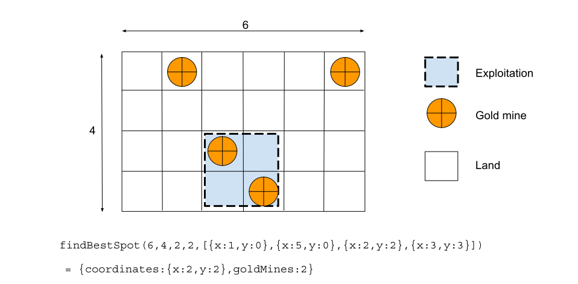

# JS-Test
Test JS and programming knowledge

## Exercise

You will be provided data about lands in California and the location of gold mines within these lands.

You will also receive the size of the future exploitation that you can afford.

Your goal is to write a program able to calculate the coordinates of the most profitable location to set up your exploitation. In short, you need to find the parcel with the most gold mines within.

## Example

Given a land of 3km by 5km containing only one gold mine at coordinate (2,2), and considering that you can afford only a 1km x 1km exploitation, your program should decide to set up your company at (2,2) in order to own 1 gold mine.

Here is a graphic example: 

## Concrete coding concerns

In your `index.js`, your program should expose a method `findBestSpot` that will accept the following parameters:
* `landWidth` : the width of the land
* `landHeight` : the height of the land
* `exploitationWidth` : the width of the exploitation you can afford
* `exploitationHeight` : the height of the exploitation you can afford
* `goldMines` : a list of **coordinates** corresponding to the location of each gold mine on the land.

*coordinates are objects containing the properties `x` and `y`, `x` and `y` being integers. For instance {x:2, y:3}.*

Your method `findBestSpot` should return an object containing the following properties:
* `coordinates` : the coordinates of the top-left corner of your future exploitation
* `goldMines` : the number of gold mines you will be owning

If `landWidth`, `landHeight`, `exploitationWidth` or `exploitationHeight` worth 0, your program should answer 'no spot'.

**IMPORTANT** if there is more than one solution, your program should return the solution with the lowest values for `x`, and for `y` with this priority. For instance, if possible coordinates are `(1,2)`, `(2,1)` and `(2,2)`, your program should return `(1,2)` as coordinates for your exploitation.

* You can safely assume that all the types provided will be respected. No need to test that integers are really integers.
* You can safely assume that the gold mines coordinates will remain within the range of the land
* The gold mines list will never contains twice the same mine.

## Get started

* clone the repo
* install npm
* run `npm install` to install all the dependencies you will be needing (jest)
* edit the file `index.js` to create your program
* run `npm run test` to test your solution

## Providing your answer

Whenever you want to publish your answer, commit your changes (`git commit`) and push them (`git push`)

**Note**
There are several ways to answer this exercise. You will have choices to make. Don't hesitate to write all of your thoughts as a comment within your code. From the moment you clone the repo, your **speed** will be taken into account, but it is not the only parameter that we will consider. **Code clarity**, **conciseness**, **performance**, **correctness** and **creativity** will receive the same consideration.